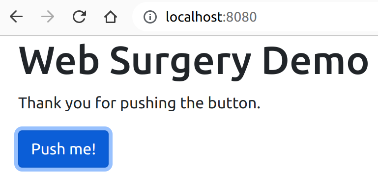
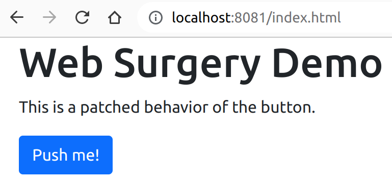

# Web Surgery
For development purposes it is sometimes necessary to _patch_ a running web application.
More specifically it might be necessary to replace certain resources
that a local client loads from a public web server that cannot be easily modified.
This project demonstrates how to do this with an 
[OpenResty](https://openresty.org/) reverse proxy.

## Folder structure
* `web-app`: 
This folder contains a very simple web application consisting of an
[index.html](web-app/index.html) page that loads an
[app.js](web-app/app.js) JavaScript file.
The JavaScript file contains the logic that is executed
if the button on the html file is pushed.

* `proxy`:
This folder contains the configuration to start an OpenResty reverse proxy.
If a client (e.g. a web browser) loads the page through the proxy an alternative
[app.js](proxy/app.js) file is used and the logic of the page is modified.

## Project requirements
In order to run OpenResty an installation of 
[docker](https://www.docker.com) is needed.
To run the example `web-app` a local web server is needed, too.
In the instructions below Python 3 is used for this purpose.

## Start local web server
Make sure you have Python 3 installed and start the web server on port 8080 as follows:
```
cd web-app
python3 -m http.server 8080
```
Now navigate to the URL [http://localhost:8080](http://localhost:8080) and push
the button that is shown on the page. The result should look like this:



## Start OpenResty
Open another terminal and start OpenResty in the proxy directory:
```
cd proxy
sh start_openresty.sh
```
Now navigate to the URL [http://localhost:8081](http://localhost:8081) and push
the button that is shown on the page. The result should look like this:


## OpenResty configuration
The OpenResty configuration is contained in the file 
[nginx.conf](proxy/nginx.conf) in the proxy directory.
Note that for this example to work you may need to modify the `proxy_pass` URL
to match the IP address of your docker host that runs the web server.
